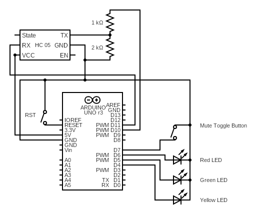
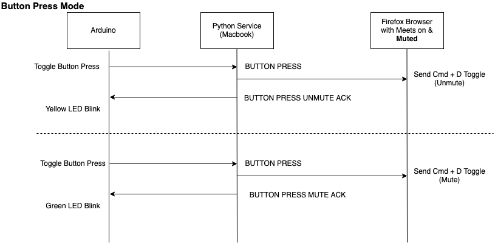

TLMM
----

### Talk Less, Mute More

A bluetooth based remote control to mute yourself on Google meets, enabling a physical push-to-talk button. It can be used for Google Meets on a Firefox in its current state on a macbook. But it is pretty simple to extend the same application for Linux/Windows on Chrome/Safari.

#### Hardware
A simple HC05 interfaced with Arduino Uno with some LEDs acting as Indicators and toggle switch used to send Mute/Unmute signals.
##### Circuit Diagram



#### Software
We assume Google Meets is already running on a Firefox and it is muted initially.
Python Script is running on a terminal on Mac in background. Check the _requirements.txt_ file for dependencies.

Simply run the python service after installing libraries:
```
$ python3 btservice.py
```

#### Working
It's a pretty simple two step handshake protocol between Arduino Module and Python service running on Mac.
When Arduino is booted up, HC-05 will try to pair with the device; in our case, a macbook.
Once paired successfully (pairing code: 1234), arduino will try to complete handshake signal.
It will send a _Hello World_ message on bluetooth serial, and expect a _Hello World Acknowledgement_ message from the Python service running on Mac.


Once hardware is properly latched, the python service goes into listening mode. Once a button is pressed, the python uses oascript tool to simulate Cmd+D keystroke for Firefox Application.



_TODO:_
* Get it working using xdtool on GNU/Linux based OS for other browsers as well.
* Button to reset Handshake signal.
* Better debounce logic.
* Replace Arduino Uno to Arduino Mini Pro.
* Clean up the code.

Shield: [![CC BY 4.0][cc-by-shield]][cc-by]

This work is licensed under a
[Creative Commons Attribution 4.0 International License][cc-by].

[cc-by]: http://creativecommons.org/licenses/by/4.0/
